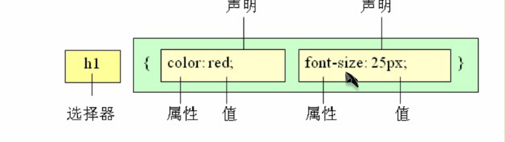
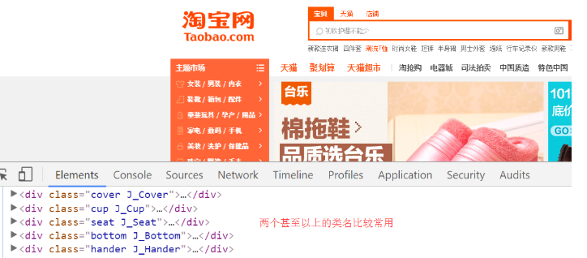
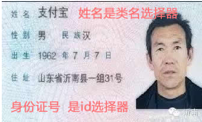
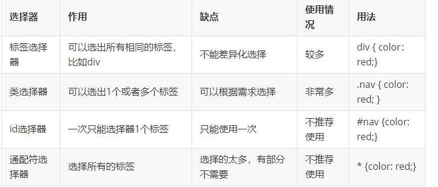
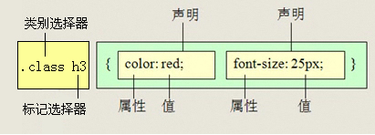
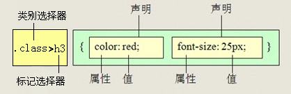
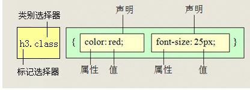
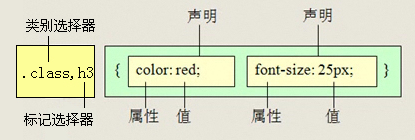

# CSS初识

一	

css 	Cascading Style Sheet	层叠样式表

## 二	行内式（内联样式）

内联样式，又有人称行内样式、行间样式，是通过标签的style属性来设置元素的样式，其基本语法格式如下：

```html
<标签名 style="属性1:属性值1; 属性2:属性值2; 属性3:属性值3;"> 内容 </标签名>
```

实际上任何HTML标签都拥有style属性，用来设置行内式。

```html
<div style="color: red; font-size: 12px;">青春不常在，抓紧敲代码</div>
```

**注意：**

- style其实就是标签的属性
- 属性和值中间是冒号。
- 多组属性值之间用分号隔开。


二	内部样式表

内嵌式是将CSS代码集中写在HTML文档的head头部标签中，并且用style标签定义，其基本语法格式如下：

```html
<head>
<style type="text/CSS">
    选择器 { 
      属性1:属性值1;
      属性2:属性值2; 
      属性3:属性值3;
    }
</style>
</head>
```

```html
<style>
	 div {
	 	color: red;
	 	font-size: 12px;
	 }
</style>
```

**注意：**

- style标签一般位于head标签中title标签之后，也可以把他放在HTML文档的任何地方。

- type="text/css"  在html5中可以省略。

  


三	外部样式表

链入式是将所有的样式放在一个或多个以.CSS为扩展名的外部样式表文件中，通过link标签将外部样式表文件链接到HTML文档中，其基本语法格式如下：

```html
<head>
  <link href="CSS文件的路径"  rel="stylesheet" />
</head>
```

注意：  link 是个单标签哦!!!

该语法中，link标签需要放在head头部标签中，并且必须指定link标签的三个属性，具体如下：

- href：定义所链接外部样式表文件的URL，可以是相对路径，也可以是绝对路径。
- type：定义所链接文档的类型，在这里需要指定为“text/CSS”，表示链接的外部文件为CSS样式表。我们都可以省略
- rel：定义当前文档与被链接文档之间的关系，在这里需要指定为“stylesheet”，表示被链接的文档是一个样式表文件。


四	样式表小结

| 样式表     | 优点                   | 缺点                     | 控制范围     |
| ---------- | ---------------------- | ------------------------ | ------------ |
| 行内样式表 | 书写方便、权重高       | 没有实现样式和结构相分离 | 控制一个标签 |
| 内部样式表 | 部分结构和样式相分离   | 没有彻底分离             | 控制也个页面 |
| 外部样式表 | 完全实现结构样式相分离 | 需要引入                 | 控制整个站点 |

五	CSS样式规则



**总结：**

1. 选择器用于指定CSS样式作用的HTML标签，花括号内是对该对象设置的具体样式。
2. 属性和属性值以“键值对”的形式出现。
3. 属性是对指定的对象设置的样式属性，例如字体大小、文本颜色等。
4. 属性和属性值之间用英文“:”连接。
5. 多个“键值对”之间用英文“;”进行区分。


## 六	css选择器

> CSS选择器干啥的？   选择标签用的， 可以把我们想要的标签选择出来 

### 1.标签选择器

标签选择器是指用HTML标签名称作为选择器，按标签名称分类，为页面中某一类标签指定统一的CSS样式。

标签选择器 可以把某一类标签全部选择出来  比如所有的div标签  和 所有的 span标签

语法：

```
标签名{属性1:属性值1; 属性2:属性值2; 属性3:属性值3; }
```

**优缺点:**

标签选择器最大的优点是能快速为页面中同类型的标签统一样式，同时这也是他的缺点，不能设计差异化样式。

### 2.类选择器

**作用：**

主要作用可以选择一个或者多个标签。

**用法：** 

   样式声明点        结构调用class

```
.类名  {   属性1:属性值1; 属性2:属性值2; 属性3:属性值3; }
 标签调用的时候用 class=“类名”  即可
```

注意

- 类选择器使用“.”（英文点号）进行标识，后面紧跟类名
- 长名称或词组可以使用中横线来为选择器命名。
- 不建议使用“_”下划线来命名CSS选择器。
- 不要纯数字、中文等命名， 尽量使用英文字母来表示。

### 多类名选择器

我们可以给标签指定多个类名，从而达到更多的选择目的。



注意：

- 样式显示效果跟HTML元素中的类名先后顺序没有关系,受CSS样式书写的上下顺序有关。
- 各个类名中间用空格隔开。

多类名选择器在后期布局比较复杂的情况下，还是较多使用的。

```html
<div class="pink fontWeight font20">亚瑟</div>
<div class="font20">刘备</div>
<div class="font14 pink">安其拉</div>
<div class="font14">貂蝉</div>
```

### 4.id选择器

id选择器使用“#”进行标识，后面紧跟id名，其基本语法格式如下：

```
#id名 {属性1:属性值1; 属性2:属性值2; 属性3:属性值3; }
```

​	该语法中，id名即为HTML元素的id属性值，大多数HTML元素都可以定义id属性，元素的id值是唯一的，只能对应于文档中某一个具体的元素。

​	用法基本和类选择器相同。

### 5.id选择器与类选择器的区别

W3C标准规定，在同一个页面内，不允许有相同名字的id对象出现，但是允许相同名字的class。

类选择器（class） 好比人的名字，  是可以多次重复使用的， 比如  张伟  王伟  李伟  李娜

id选择器     好比人的身份证号码，  全中国是唯一的， 不得重复。 只能使用一次。

##### **d选择器和类选择器最大的不同在于 使用次数上**



### 6.通配符选择器

通配符选择器用“*”号表示，  *  就是 所有的      他是所有选择器中作用范围最广的，能匹配页面中所有的元素。其基本语法格式如下：

​	通配符选择器用“*”号表示，  *  就是 所有的      他是所有选择器中作用范围最广的，能匹配页面中所有的元素。其基本语法格式如下：

```
* { 属性1:属性值1; 属性2:属性值2; 属性3:属性值3; }
```

​	使用通配符选择器定义CSS样式，清除所有HTML标记的默认边距。

```html
*{
  margin: 0;                    /* 定义外边距*/
  padding: 0;                   /* 定义内边距*/
}
```

### 7	基础选择器总结



### 8	复合选择器

#### a	后代选择器

​	后代选择器又称为包含选择器，用来选择元素或元素组的后代，其写法就是把外层标签写在前面，内层标签写在后面，中间用空格分隔。当标签发生嵌套时，内层标签就成为外层标签的后代。



子孙后代都可以这么选择。 或者说，它能选择任何包含在内 的标签。 


#### b	子代选择器

子元素选择器只能选择作为某元素子元素的元素。其写法就是把父级标签写在前面，子级标签写在后面，中间跟一个 &gt; 进行连接，注意，符号左右两侧各保留一个空格。



白话：  这里的子 指的是 亲儿子  不包含孙子 重孙子之类。

#### c	交集选择器

其中第一个为标签选择器，第二个为class选择器，两个选择器之间不能有空格，如h3.special。



**记忆技巧：**

交集选择器 是 并且的意思。  即...又...的意思

```
比如：   p.one   选择的是： 类名为 .one  的 段落标签。  
```

用的相对来说比较少，不太建议使用。

d	并集选择器

并集选择器（CSS选择器分组）是各个选择器通过<strong style="color:#f00">逗号</strong>连接而成的，任何形式的选择器（包括标签选择器、class类选择器id选择器等），都可以作为并集选择器的一部分。如果某些选择器定义的样式完全相同，或部分相同，就可以利用并集选择器为它们定义相同的CSS样式。

​	

并集选择器  和 的意思，  就是说，只要逗号隔开的，所有选择器都会执行后面样式。

```
比如  .one, p , #test {color: #F00;}  表示   .one 和 p  和 #test 这三个选择器都会执行颜色为红色。  通常用于集体声明。
```

#### e	相邻选择器

#####         基本语法:  选择器1+选择器2,     目的是为了精准选择选择器1`后边的选择器2`

```
div+p  是为了选择紧挨着div后边的p标签
```

#### f	伪类选择器

  伪类选择器用于向某些选择器添加特殊的效果。比如给链接添加特殊效果， 比如可以选择 第1个，第n个元素。

```
为了和我们刚才学的类选择器相区别，  类选择器是一个点 比如 .demo {}   而我们的伪类 用 2个点 就是 冒号  比如  :link{}
```

### 链接伪类选择器

- :link      /* 未访问的链接 */
- :visited   /* 已访问的链接 */
- :hover     /* 鼠标移动到链接上 */
- :active    /* 选定的链接 */

  **注意**

- 写的时候，他们的顺序尽量不要颠倒  按照  lvha 的顺序。  
- 记忆法  可以是   love   hate  爱上了讨厌     或者   lv 包包 非常 hao 
- 因为叫链接伪类，所以都是 利用交集选择器  a:link    a:hover  


### 9	复合选择器总结

| 选择器     | 作用                       | 特征                 | 使用情况 | 用法                        |
| ---------- | -------------------------- | -------------------- | -------- | --------------------------- |
| 后代选择器 | 用来选择元素或元素组的后代 | 是选择所有的子孙后代 | 较多     | div p { color：red;}        |
| 子代选择器 | 选择作为某元素子元素的元素 | 只选亲儿子           | 较少     | .nav>p { color: red; }      |
| 交集选择器 | 选择两个标签交集的部分     |                      | 较少     | a:link {color: red;}        |
| 并集选择器 | 选择某些相同样式的选择器   | 可以用于集体声明     | 较多     | .nav, .header {color: red;} |

### 10	CSS注释

> /*  需要注释的内容  */  进行注释的，即在需要注释的内容前使用 “/*” 标记开始注释，在内容的结尾使用 “*/”结束。快捷键 ctrl+/

```html
p {
  font-size: 14px;                 /* 所有的字体是14像素大小*/
}
```

### 11	sublime快捷方式

sublime可以快速提高我们代码的书写方式  

1. 生成标签 直接输入标签名 按tab键即可   比如  div   然后tab 键， 就可以生成 <div></div>
2. 如果想要生成多个相同标签  加上 * 就可以了 比如   div*3  就可以快速生成3个div
3. 如果有父子级关系的标签，可以用 >  比如   ul > li就可以了
4. 如果有兄弟关系的标签，用  +  就可以了 比如 div+p  
5. 如果生成带有类名或者id名字的，  直接写  .demo  或者  #two   tab 键就可以了

```
.div +tab
div>ul>li*3
div>a[#]{hahah}(sublime可以，hbuilder就不太行)
```

