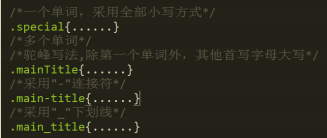

# CSS样式命名

### css样式命名规则

- 采用英文字母、数字以及“-”和“_”命名
- 以小写字母开头，不能以数字和“-”、“_”开头
- 命名形式：单字，连字符，下划线和驼峰

- ##### 	使用有意义命名

  ##### 常见css样式命名：

  | 页面结构                |                           |
  | ----------------------- | ------------------------- |
  | 页面：header            | 导航：nav                 |
  | 页面主体：main          | 侧栏：sidebar             |
  | 页尾：footer            | 栏目：column              |
  | 内容：content/container | 页面外围控制：wrapper     |
  | 容器：container         | 左右中：left right center |

  | 导航             |                      |
  | ---------------- | -------------------- |
  | 导航：nav        | 左导航：leftsidebar  |
  | 主导航：mainnav  | 右导航：rightsidebar |
  | 子导航：subnav   | 菜单：menu           |
  | 顶部导航：topnav | 子菜单：submenu      |
  | 边导航：sidebar  | 标题title            |
  |                  | 摘要：summary        |

  | 功能             |                |
  | ---------------- | -------------- |
  | 标志：logo       | 注册：register |
  | 广告：banner     | 搜索：search   |
  | 登录：login      | 功能区：shop   |
  | 登录条：loginbar | 标题：title    |
  |                  |                |

  

