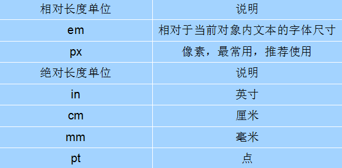
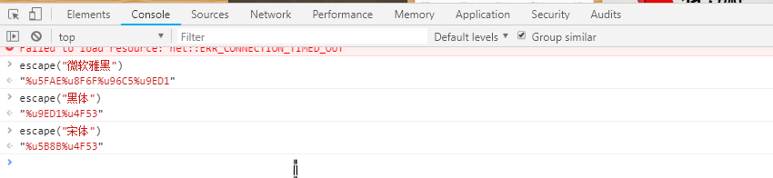
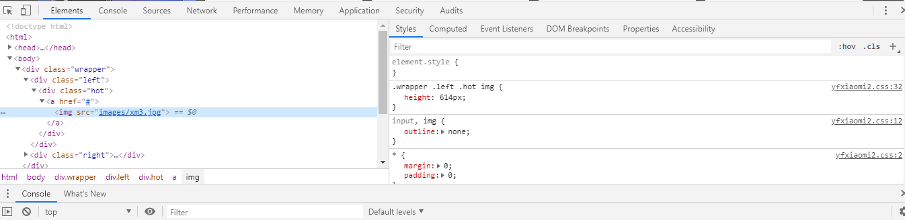
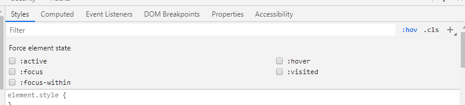

# CSS字体样式属性

1	font-size:字号

font-size属性用于设置字号，该属性的值可以使用相对长度单位，也可以使用绝对长度单位。

推荐使用像素单位px。



### 2	font-family：字体

font-family属性用于设置字体。网页中常用的字体有宋体、微软雅黑、黑体等

##### 可以同时指定多个字体，中间以英文逗号隔开，表示如果浏览器不支持第一个字体，则会尝试下一个，直到找到合适的字体。 

1. ```
   ##### 几点：
   
   1. **现在网页中普遍使用14px+。**
   2. **尽量使用偶数的数字字号。ie6等老式浏览器支持奇数会有bug。**
   3. **各种字体之间必须使用英文状态下的逗号隔开。**
   4. **中文字体需要加英文状态下的引号，英文字体一般不需要加引号。当需要设置英文字体时，英文字体名必须位于中文字体名之前。**
   5. **如果字体名中包含空格、#、$等符号，则该字体必须加英文状态下的单引号或双引号，例如font-family: "Times New Roman";。**
   6. **尽量使用系统默认字体，保证在任何用户的浏览器中都能正确显示。
   ```

   2.  css Unicode字体

      在 CSS 中设置字体名称，直接写中文是可以的。但是在文件编码（GB2312、UTF-8 等）不匹配时会产生乱码的错误。xp 系统不支持 类似微软雅黑的中文。

      ```
      方案一： 你可以使用英文来替代。 比如 font-family:"Microsoft Yahei"。
      
      方案二： 在 CSS 直接使用 Unicode 编码来写字体名称可以避免这些错误。使用 Unicode 写中文字体名称，浏览器是可以正确的解析的。
      font-family: "\5FAE\8F6F\96C5\9ED1"，表示设置字体为“微软雅黑”。
      ```

      

   3.在开发者工具中，我们可以通过escape（）来了解字体的Unicode值

   


| 字体名称    | 英文名称        | Unicode 编码         |
| ----------- | --------------- | -------------------- |
| 宋体        | SimSun          | \5B8B\4F53           |
| 新宋体      | NSimSun         | \65B0\5B8B\4F53      |
| 黑体        | SimHei          | \9ED1\4F53           |
| 微软雅黑    | Microsoft YaHei | \5FAE\8F6F\96C5\9ED1 |
| 楷体_GB2312 | KaiTi_GB2312    | \6977\4F53_GB2312    |
| 隶书        | LiSu            | \96B6\4E66           |
| 幼园        | YouYuan         | \5E7C\5706           |
| 华文细黑    | STXihei         | \534E\6587\7EC6\9ED1 |
| 细明体      | MingLiU         | \7EC6\660E\4F53      |
| 新细明体    | PMingLiU        | \65B0\7EC6\660E\4F53 |

### 3	font-weight	字体粗细

字体加粗除了用 b  和 strong 标签之外，可以使用CSS 来实现，但是CSS 是没有语义的。

> font-weight属性用于定义字体的粗细，其可用属性值：normal、bold、bolder、lighter、100~900（100的整数倍）。

```
数字 400 等价于 normal，而 700 等价于 bold。  但是我们更喜欢用数字来表示。  
```

### 4	font-style	字体风格

字体倾斜除了用 i  和 em 标签之外，可以使用CSS 来实现，但是CSS 是没有语义的。

font-style属性用于定义字体风格，如设置斜体、倾斜或正常字体，其可用属性值如下：

normal：默认值，浏览器会显示标准的字体样式。

italic：浏览器会显示斜体的字体样式。

oblique：浏览器会显示倾斜的字体样式。

### 5	letter-spacing	控制字（母）和字（母）之间的距离

```
letter-spacing: 10px;
```

### 	word-spacing	控制单词与单词之间的距离 中文无效 值越大距离越大 可以为负值

```
word-spacing: 20px;
```

### 6	line-height	行间距

ine-height属性用于设置行间距，就是行与行之间的距离，即字符的垂直间距，一般称为行高。line-height常用的属性值单位有三种，分别为像素px，相对值em和百分比%，实际工作中使用最多的是像素px和相对值em

### 7	font	设置综合字体样式

font属性用于对字体样式进行综合设置，其基本语法格式如下：

```html
选择器{font: font-style  font-weight  font-size/line-height  font-family;}
```

```
使用font属性时，必须按上面语法格式中的顺序书写，不能更换顺序，各个属性以空格隔开。（好像style和weight的属性可以互换没问题）
注意：其中不需要设置的属性可以省略（取默认值），但必须保留font-size和font-family属性，否则font属性将不起作用。
```

### 8	css外观属性

#### 1	color：文本颜色

​	color属性用于定义文本的颜色，其取值方式有如下3种：

```
1.预定义的颜色值，如red，green，blue等。

2.十六进制，如#FF0000，#FF6600，#29D794等。实际工作中，十六进制是最常用的定义颜色的方式。

3.RGB代码，如红色可以表示为rgb(255,0,0)或rgb(100%,0%,0%)。

需要注意的是，如果使用RGB代码的百分比颜色值，取值为0时也不能省略百分号，必须写为0%。
```

2	text-indent：首行缩进

​	text-indent属性用于设置首行文本的缩进，其属性值可为不同单位的数值、em字符宽度的倍数、或相对于浏览器窗口宽度的百分比%，允许使用负值, 建议使用em作为设置单位。

​	1em 就是一个字的宽度   如果是汉字的段落， 1em 就是一个汉字的宽度

```
p {
      /*行间距*/
      line-height: 25px;
      /*首行缩进2个字  em  1个em 就是1个字的大小*/
      text-indent: 2em;  
 }
```

3	text-align	文本水平对齐方式	块内元素水平对齐

```
left：左对齐（默认值）

right：右对齐

center：居中对齐

是让盒子里面的内容水平居中， 而不是让盒子居中对齐
```

4	text-decoration 	文本装饰

| 值           | 描述                                          |
| ------------ | --------------------------------------------- |
| none         | 默认。定义标准的文本。 取消下划线             |
| underline    | 定义文本下的一条线。下划线 也是我们链接自带的 |
| overline     | 定义文本顶部的一条线。                        |
| line-through | 定义穿过文本下的一条线。删除线                |
|              |                                               |
|              |                                               |

说一下chrome的开发者工具：

​	在网页中右键点击检查，会在下方出现的源码中直接定位到鼠标所在的源码，总共分为两部分

​	一部分显示html，另一部分显示style



右边有个小选项	：hov	可以查看显示鼠标滑过后的style，还有其他伪类



