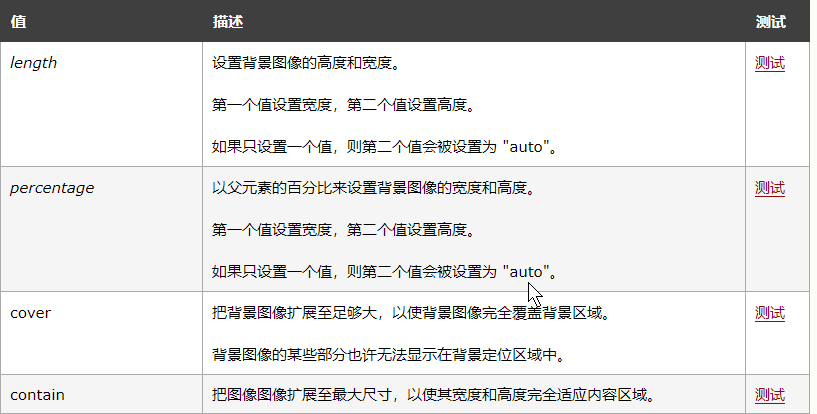

## CSS标签显示模式

### 1	块级元素	block

​	常见的块元素

```
常见的块元素有<h1>~<h6>、<p>、<div>、<ul>、<ol>、<li>等，其中<div>标签是最典型的块元素。
```

```
**块级元素的特点** 

（1）总是从新行开始

（2）高度，行高、外边距以及内边距都可以控制。

（3）宽度默认是容器的100%

（4）可以容纳内联元素和其他块元素。

（5） 是一个容器及盒子，里面可以放行内或者块级元素
```

### 2	行内元素	inline

行内元素（内联元素）不占有独立的区域，仅仅靠自身的字体大小和图像尺寸来支撑结构，一般不可以设置宽度、高度、对齐等属性，常用于控制页面中文本的样式。

```
常见的行内元素有<a>、<strong>、<b>、<em>、<i>、<del>、<s>、<ins>、<u>、<span>等，其中<span>标签最典型的行内元素。
```

行内元素的特点：

（1）和相邻行内元素在一行上。

（2）高、宽无效，但水平方向的padding和margin可以设置，垂直方向的无效。

（3）默认宽度就是它本身内容的宽度。

（4）行内元素只能容纳文本或则其他行内元素。

 注意：

- 只有 文字才 能组成段落  因此 p  里面不能放块级元素，同理还有这些标签h1,h2,h3,h4,h5,h6,dt，他们都是文字类块级标签，里面不能放其他块级元素。 p 不能放div 
- 链接里面不能再放链接。


### 3	行内块元素	inline-block

```
在行内元素中有几个特殊的标签——、<input />、<td>，可以对它们设置宽高和对齐属性，有些资料可能会称它们为行内块元素。
行内块元素的特点：
（1）和相邻行内元素（行内块）在一行上,但是之间会有空白缝隙。
（2）默认宽度就是它本身内容的宽度。
（3）高度，行高、外边距以及内边距都可以控制。
```

### 4	三种模式的区别

| 元素模式   | 元素排列               | 设置样式               | 默认宽度         | 包含                     |
| ---------- | ---------------------- | ---------------------- | ---------------- | ------------------------ |
| 块级元素   | 一行只能放一个块级元素 | 可以设置宽度高度       | 容器的100%       | 容器级可以包含任何标签   |
| 行内元素   | 一行可以放多个行内元素 | 不可以直接设置宽度高度 | 它本身内容的宽度 | 容纳文本或则其他行内元素 |
| 行内块元素 | 一行放多个行内块元素   | 可以设置宽度和高度     | 它本身内容的宽度 |                          |

### 5	标签显示模式转换 display

块转行内：display:inline;

行内转块：display:block;

块、行内元素转换为行内块： display: inline-block;


## CSS背景	background

| background-color                                            | 背景颜色         |
| ----------------------------------------------------------- | ---------------- |
| background-image                                            | 背景图片地址     |
| background-repeat                                           | 是否平铺         |
| background-position                                         | 背景位置         |
| background-attachment                                       | 背景固定还是滚动 |
| 背景的合写（复合属性）                                      |                  |
| background:背景颜色 背景图片地址 背景平铺 背景滚动 背景位置 |                  |

### 1	背景图片	background-image

```
background-image : none | url (url) 
```

参数： 

none : 　无背景图（默认的）
url : 　使用绝对或相对地址指定背景图像 

background-image 属性允许指定一个图片展示在背景中（只有CSS3才可以多背景）可以和 background-color 连用。 如果图片不重复地话，图片覆盖不到地地方都会被背景色填充。 如果有背景图片平铺，则会覆盖背景颜色。

### 2	背景平铺	background-repeat

```
background-repeat : repeat | no-repeat | repeat-x | repeat-y 
```

参数： 

repeat : 　背景图像在纵向和横向上平铺（默认的）

no-repeat : 　背景图像不平铺

repeat-x : 　背景图像在横向上平铺

repeat-y : 　背景图像在纵向平铺 

设置背景图片时，默认把图片在水平和垂直方向平铺以铺满整个元素。

repeat-x : 　背景图像在横向上平铺 

repeat-y : 　背景图像在纵向平铺 

### 3	背景位置 background-position

```html
background-position : length || length

background-position : position || position 
```

参数： 

length : 　百分数 | 由浮点数字和单位标识符组成的长度值。请参阅长度单位	水平 垂直 
position : 　top | center | bottom | left | center | right   方位名词

注意：

1. 我们可以使用方位名词， 如果只写一个方位名词， 那么另外一个默认居中对齐。 他们不分顺序  top  left  和  left top是一样
2. position 后面是x坐标和y坐标。 也可使用 精确单位。但是他们有顺序  10px  50px  和   50px 10px 不一样的
3. 如果和精确单位和方位名字混合使用，则必须是x坐标在前，y坐标后面。比如 background-position: 15px top;   则 15px 一定是  x坐标   top是 y坐标。


### 4	背景附着 background-attachment

```
background-attachment : scroll | fixed 
```

参数： 

scroll : 　背景图像是随对象内容滚动
fixed : 　背景图像固定 

设置或检索背景图像是随对象内容滚动还是固定的。

### 5	background-size

规定背景图像的尺寸：



### 6	背景简写

background属性的值的书写顺序官方并没有强制标准的。为了可读性，建议大家如下写：

background:背景颜色 背景图片地址 背景平铺 背景滚动 背景位置

```css
background: transparent url(image.jpg) repeat-y  scroll 50% 0 ;
```

transparent  颜色透明

上边忘写了background-color，补上，跟color属性一样，不多说了

### 提一笔：

在一行内的盒子内，我们设定行高等于盒子的高度，就可以使文字垂直居中。