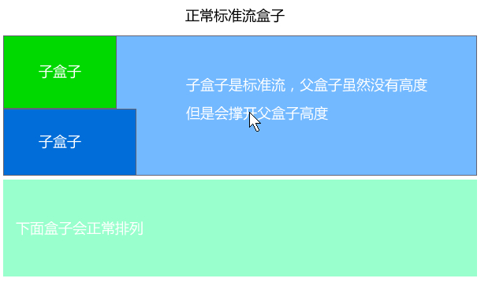
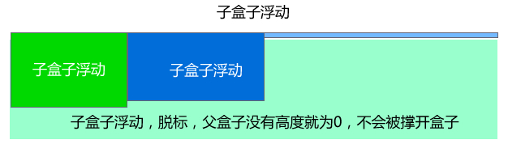

# 浮动与浮动清除

## 一	为啥要清除浮动？

清除浮动主要是为了解决父级元素因为子级浮动引起内部高度为0的问题





二	清除浮动的方法

**清除浮动的影响 ** 

其实本质叫做闭合浮动更好一些, 记住，清除浮动就是把浮动的盒子圈到里面，让父盒子闭合出口和入口不让他们出来影响其他元素。

在CSS中，clear属性用于清除浮动，其基本语法格式如下：

```
选择器{clear:属性值;}   clear 清除  
```

| 属性值 | 描述                                       |
| ------ | ------------------------------------------ |
| left   | 不允许左侧有浮动元素（清除左侧浮动的影响） |
| right  | 不允许右侧有浮动元素（清除右侧浮动的影响） |
| both   | 同时清除左右两侧浮动的影响                 |

### 方法1	额外标签法

> 是W3C推荐的做法是通过在浮动元素末尾添加一个空的标签例如 <div style="clear:both"></div>，或则其他标签br等亦可。

优点： 通俗易懂，书写方便

缺点： 添加许多无意义的标签，结构化较差。

### 方法2	父集添加overflow属性方法

可以通过触发BFC的方式，实现清除浮动的效果

```
可以给父级添加： overflow为 hidden| auto| scroll  都可以实现。
```

优点：  代码简洁

缺点：  内容增多时候容易造成不会自动换行导致内容被隐藏掉，无法显示需要溢出的元素。

### 方法3	使用after伪元素清除浮动

**:after 方式为空元素额外标签法的升级版，好处是不用单独加标签了**

使用方法：

```css
 .clearfix:after {  content: ""; display: block; height: 0; clear: both; visibility: hidden;  }   
/*注意：content为必写项！！！*/
 .clearfix {*zoom: 1;}   /* IE6、7 专有 */
```

优点： 符合闭合浮动思想  结构语义化正确

缺点： 由于IE6-7不支持:after，使用 zoom:1触发 hasLayout。

代表网站： 百度、淘宝网、网易等

### 方法4	使用before和after双伪元素清除浮动

使用方法：

```css
.clearfix:before,.clearfix:after { 
  content:"";
  display:table;  
}
.clearfix:after {
 clear:both;
}
.clearfix {
  *zoom:1;
}
```

优点：  代码更简洁

缺点：  由于IE6-7不支持:after，使用 zoom:1触发 hasLayout。

代表网站： 小米、腾讯等