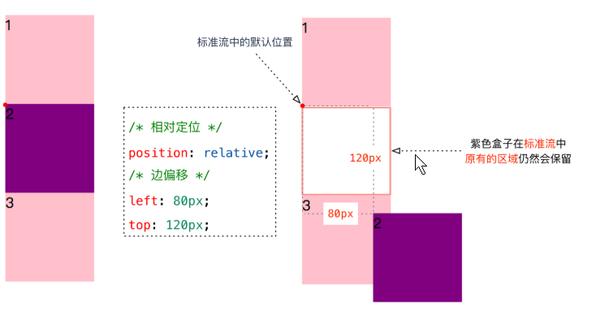
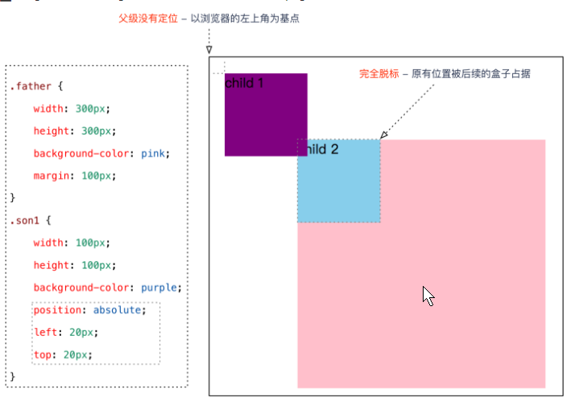
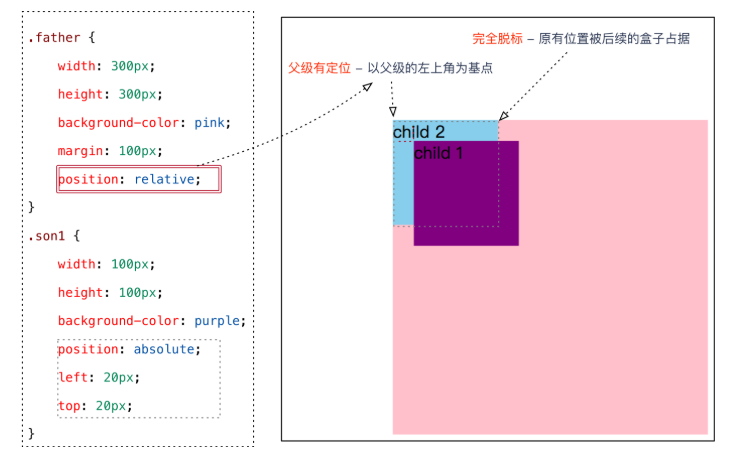
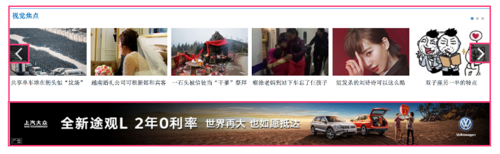
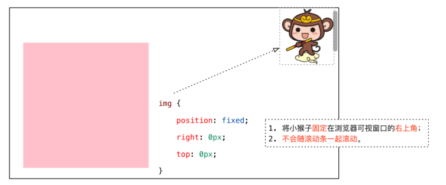
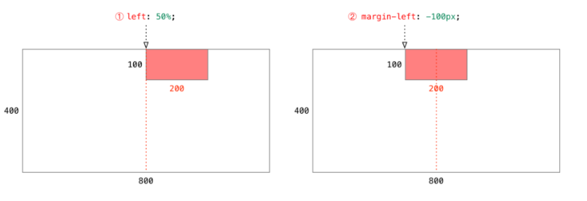

## 一	css布局

### 1	普通流（标准流）

- 一个网页内的标签元素按照**从上到下，从左到右**的顺序排列：

- **块级元素**会独占一行，**从上向下**顺序排列。
- **行内元素**会按照顺序，**从左到右**顺序排列。


### 2	浮动

- 让盒子从普通流中**浮**起来 —— **让多个盒子(div)水平排列成一行**。


### 3	定位

- 将盒子**定**在某一个**位**置  漂浮在其他盒子的上面  —— CSS 离不开定位，特别是后面的 js 特效。


## 二	认识定位（position）

概念**：`定位 = 定位模式 + 边偏移`，将盒子**定**在某一个**位**置。

### 1	边偏移

在 CSS 中，通过 `top`、`bottom`、`left` 和 `right` 属性定义元素的**边偏移**：（方位名词）

| 边偏移属性 | 示例           | 描述                                                     |
| ---------- | :------------- | -------------------------------------------------------- |
| `top`      | `top: 80px`    | **顶端**偏移量，定义元素相对于其父元素**上边线的距离**。 |
| `bottom`   | `bottom: 80px` | **底部**偏移量，定义元素相对于其父元素**下边线的距离**。 |
| `left`     | `left: 80px`   | **左侧**偏移量，定义元素相对于其父元素**左边线的距离**。 |
| `right`    | `right: 80px`  | **右侧**偏移量，定义元素相对于其父元素**右边线的距离**。 |

注意**：

1. **边偏移**需要和**定位模式**联合使用，**单独使用无效**；
2. `top` 和 `bottom` 不要同时使用；
3. `left` 和 `right` 不要同时使用。


### 2	定位模式（分类）

在 CSS 中，通过 `position` 属性定义元素的**定位模式**，语法如下：

```
选择器 { position: 属性值; }
```

| 值         |     语义     |   关键词   | 描述                                       |
| ---------- | :----------: | :--------: | ------------------------------------------ |
| `static`   | **静态**定位 | **不定位** | 所有元素的默认定位方式。                   |
| `relative` | **相对**定位 |  **自恋**  | 相对于其**原标准流的位置**进行定位         |
| `absolute` | **绝对**定位 |  **拼爹**  | 相对于其上一个**已经定位的父元素**进行定位 |
| `fixed`    | **固定**定位 | **浏览器** | 相对于**浏览器窗口**进行定位               |

### 3	定位模式之间的区别

#### 3.1	静态定位（static）

**静态定位**是元素的默认定位方式，也就是说网页中所有元素默认都是静态定位的** —— 按照标准流特性摆放位置。

> 用大白话来讲，**在不需要定位元素时，元素的定位属性就是 `static` 的**。
>
> 注意**：在**静态模式**下，无法通过**边偏移属性**（`top`、`bottom`、`left` 或 `right`）来改变元素的位置。

提示：因为是默认值，所以静态定位在布局时不使用，但是要知道。

#### 3.2	相对定位（relative）

相对定位是元素相对于它在标准流中的位置 + 边偏移属性 来设置元素的位置。（自恋型）



**相对定位小结** —— **相对定位不脱标**

1. 以 `自己在标准流位置的左上角为基点 + 边偏移属性` 定位元素新的位置；
2. 原来**在标准流的区域继续占有**，后面的盒子仍然以标准流的方式对待它。

##### 与浮动的对比

- **浮动** —— 让多个块级元素在一行显示，**脱离标准流**；
- **相对定位** —— 让盒子移动到我们想要的位置，**不脱标**。


#### 3.3	绝对定位	absolute

**绝对定位**有两个重要的概念：（拼爹型）

1. **完全脱标** —— 完全不占位置；  
2. **父元素要有定位** —— `父元素在标准流中的位置 + 边偏移属性` 来设置元素的位置；
   - 如果当前父元素没有定位（相对、绝对或固定），则寻找上一级有定位的父元素；
   - 如果所有父元素都没有定位，则以浏览器为准定位（Document 文档）。
   - 如果父亲有定位，则以父亲为准。



当父级有定位的时候：



**定位口诀 —— 子绝父相**

**子绝父相 —— 子级是绝对定位，父级要用相对定位。**

> **子绝父相**是使用绝对定位的口诀，要牢牢记住！

> 提一句：
>
> 为什么在布局时，**子级元素**使用**绝对定位**时，**父级元素**就要用**相对定位**呢？
>
> 
>
> **分析**：
>
> 1. **方向箭头**叠加在其他图片上方，应该使用**绝对定位**，因为**绝对定位完全脱标**，完全不占位置。
> 2. **父级盒子**应该使用**相对定位**，因为**相对定位不脱标**，后续盒子仍然以标准流的方式对待它。
>    - 如果父级盒子也使用**绝对定位**，会完全脱标，那么下方的**广告盒子**会上移，这显然不是我们想要的。
>
> **结论**：**父级要占有位置，子级要任意摆放**，这就是**子绝父相**的由来。

#### 3.4	固定定位	fixed

固定定位是绝对定位的一种特殊形式： （认死理型）

1. 完全脱标 —— 完全不占位置；
2. 只认浏览器的可视窗口 —— `浏览器可视窗口 + 边偏移属性` 来设置元素的位置；
   - 跟父元素没有任何关系；
   - 不随滚动条滚动。



## 三	小扩展

### 	绝对定位的盒子居中

第一种：在使用**绝对定位**时要想实现水平居中，可以按照下图的方法：

> **1. left: 50%; ：让盒子的左侧移动到父级元素的水平中心位置；**
>
> **2. margin-left: -100px;：让盒子向左移动自身宽度的一半。**第二种：

第二种：

​	

```
			.box .xiaobox{
				height: 100px;
				width: 100px;
				background: #eee;
				position: absolute;
				top: 0;
				bottom: 0;
				left: 0;
				right: 0;
				margin:auto;
			}
```

即：top，bottom，left，right皆是0，再加上个margin：auto；就能实现居中对齐了

### 堆叠顺序	z-index

在使用定位布局时，可能会出现盒子重叠的情况。应用 `z-index` 层叠等级属性可以调整盒子的堆叠顺序。

`z-index` 的特性如下：

1. **属性值**：**正整数**、**负整数**或 **0**，默认值是 0，数值越大，盒子越靠上；
2. 如果**属性值相同**，则按照书写顺序，**后来居上**；
3. **数字后面不能加单位**。

**注意**：`z-index` 只能应用于**相对定位**、**绝对定位**和**固定定位**的元素，其他**标准流**、**浮动**和**静态定位**无效。

