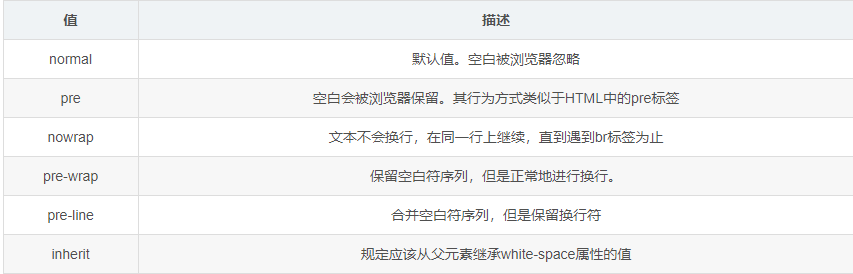
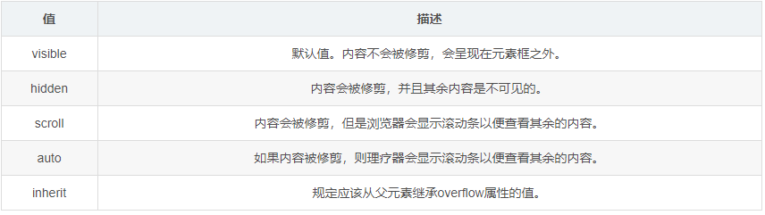
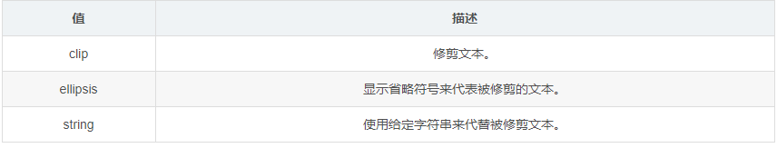

# 单行文字溢出变省略号

​	设置三个属性white-space：nowrap；	overflow：hidden；	text-overflow：ellipsis;

##### 	记得该元素要设置宽度。

```html
white-space:nowrap;/*规定段落中的文本不进行换行*/
overflow:hidden;/*内容会被修剪，并且其余内容是不可见的。*/
text-overflow:ellipsis;/*显示省略号来代表被修剪的文本*/

```

### 属性详解

###### white-space：



###### overflow：



###### text-overflow：规定当文本溢出包含元素时发生的事情。



