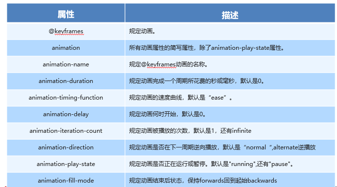

# day1-CSS2D动画

## 1	translate 移动

**可以改变元素在页面中的位置，类似定位**

语法：

```css
/* 单个写*/
transform: translateX(100px);
transform: translateY(-50%);

/* 合起来写*/
transform: translate(100px, 100px);

/* 百分数*/
transform: translate(50%, 50%);
```

**transform:translate(X,Y)与定位的区别**

- **定位**：

​	**会影响其他盒子位置（脱标）；**

​	**行内元素定位，直接变为块元素；**

- **移动**：

​	**不影响其他元素的位置：**

​	**在行内元素无效，对块级元素生效；**

## 2	居中方案

核心语法：不需要关注盒子的自身的宽与高

```css
position: absolute;
left: 50%;
top: 50%;
/* margin-left: -150px;
margin-top: -100px; */
/* 沿着X轴 Y轴 负方向 移动 自身宽高的一半*/
transform: translate(-50%, -50%);
```

## 3	rotate	旋转

**语法：正值为顺时针，默认中心点旋转；**

```css
transform:rotate(45deg);	/*默认中心点*/
transform:rotateX(45deg);	/*沿X轴*/
transform:rotateY(45deg);	/*沿Y轴*/
transform:rotateZ(45deg);	/*沿Z轴*/
```

## 4	旋转案列-下拉三角形

- 伪元素：
  - 常用：做小图标引用；
  - 特点：
    - 行内元素，
    - **content属性不能丢；**
    - div::before:hover不能这样用；用法：div:hover::before
    - **伪元素只能用在双标签上；**
- 变化：基于45deg基础上进行变化；

**主要代码：**

```css
<style>
    .p {
      width: 300px;
      height: 30px;
      border: 1px solid #000;
      position: relative;
    }
    
    .p::before {
      content: "";
      width: 10px;
      height: 10px;
      /* background-color: red; */
      position: absolute;
      top: 5px;
      right: 5px;
      border-right: 1px solid #000;
      border-bottom: 1px solid #000;
      transform: rotate(45deg);
      transition: all 0.3s;
    }
    /* 伪元素不能跟着hover */
    /* .p::before:hover {
      transform: rotate(180deg);
    } */
    
    .p:hover::before {
      transform: rotate(225deg);
    }
  </style>
```

```html
<body>
  <div class="p"></div>
</body>
```

## 5	旋转中心原点（了解）

语法：影响旋转的中心点设置

```css
/* 具体PX值*/
transform-origin:100px 100px;
/* 百分数*/
transform-origin:50% 50%;
/* 方位名词*/
transform-origin:left bottom;

/* 单个参数，第二个值默认为50%*/
transform-origin:0;
```

## 6	scale()	缩放 

特点：

- transform:不会影响其他盒子的位置；
- 可以使下面的文字、子元素、CSS属性值都跟着缩放；

```css
/* 宽高方向有各自的缩放比；*/
transform: scale(2, 2); 

/* 宽高方向有使用同一个缩放比；*/
transform: scale(1); 
```

> 提一句：缩放值可以为负数

## 7	转化综合语法

```css
	  /* 会覆盖,不可以 */
      /* transform: translateX(500px);
      transform: rotate(45deg); */
      
      /* 常规写法*/
      /* transform: translate(400px, 0) rotate(90deg) scale(1.5); */
      
      SSS	/* 把rotate放在translate前面，rotate会改变初始轴向,了解 */
      transform: rotate(90deg) translate(400px, 0) scale(1.5);
```

## 8	定义动画

语法：

```css
 /* 1.定义动画  */
    
    @keyframes dong_hua {
      /* 开始状态 */
      from {
        /* CSS代码 */
        transform: translate(0, 0);
        background-color: #222;
      }
      /* 结束状态 */
      to {
        transform: translate(800px, 0);
        background-color: red;
      }
    }


   /*2.调用及动画时间*/
   div {
      /* 调用 */
      animation-name: dong_hua;
      /* 动画执行时间 */
      animation-duration: 2s;
    }
```

## 9	动画序列

时间节点：

```css
 @keyframes move {
      /* 动画序列、又叫时间节点 */
      0% {
        transform: translate(0, 0);
      }
      50% {
        transform: translate(800px, 0);
      }
      100% {
        /* transform:基于上一个状态的变化 */
        transform: translate(800px, 500px);
      }
    }
```

## 10	动画属性



属性详解：

- **animation-timing-function：动画 运动 速度曲线：速度快慢的体现；**

```css
div{
    /* 匀速  */
    animation-timing-function: linear;

    /* 慢-快-慢  默认值  */
    animation-timing-function: ease;

    /* 慢-快  */
    animation-timing-function: ease-in;

    /* 快-慢  */
    animation-timing-function: ease-out;

    /* 慢-快-慢  */
    animation-timing-function: ease-in-out;
}
```

- **animation-timing-function：steps(n)  分步 实现 老电影一帧一帧，整个动画分为几步骤完成**

```css
/* 分步 实现 老电影一帧一帧，整个动画分为几步骤完成*/
animation-timing-function: steps(n);
```

- **animation-delay：动画推迟多久执行；动画得等待。**
- **animation-iteration-count：播放循坏次数 1 2  infinite无限次** 

```css
div{
    /* 指定次数设置  */
    animation-iteration-count: 2;

    /* 无限次数设置  */
    animation-iteration-count: infinite;
}
```

- **animation-direction：循环方向：若0% 初始状态; 100%结束状态**

```css
div{
    /*1 默认值 0-100 */
    animation-direction: normal;
    
    /*2 100-0 */
    animation-direction: reverse;
    
    /*3 0-100-0 */
    animation-direction: alternate;

    /*4 100-0-100 */
    animation-direction: alternate-reverse;
}
```

- animation-fill-mode：动画等待或者结束的状态;

```css
div{
    /*1 动画结束后，元素样式停留在 100% 的样式 */
    animation-fill-mode: forwards;
    
    /*2 在延迟等待的时间内，元素样式停留在 0% 的样式 
    动画结束的时候，回到div本身的样式（回到起始状态）
    */
    animation-fill-mode: backwards;
    
    /*3 同时设置了 forwards和backwards两个属性值
    在动画等待时间，样式为元素样式停留在 0% 的样式，
    动画结束时，元素样式停留在 100% 的样式
     */
    animation-fill-mode: both;
}
```

- animation-play-state：暂停和播放

```css
div{
    /*1 播放 */
    animation-play-state: running;
    /*2 暂停*/
    animation-play-state: paused;
}
```

**注意**

- 设置 animation-direction ，需设置动画 多次 执行；
- 设置 animation-fill-mode，设置forwards ，动画不能设置 无限 执行；


练习代码：

```css
 div {
      /* 调用 */
      animation-name: move;
      /* 时间 */
      animation-duration: 2s;
      
      
      /* 速度曲线：默认是 ease  慢-快-慢*/
      /* linear:  匀速 */
      /* animation-timing-function: linear; */
      /* steps使用场景： 分帧图*/
      /* animation-timing-function: steps(3); */
      
      
      /* 延时 */
      animation-delay: 2s;
      
      /* 播放次数 */
      /* animation-iteration-count: 2; */
      /* animation-iteration-count: infinite; */
      
      /* 播放方向,用的不多 */
      /* 100-0 reverse 反向*/
      /* animation-direction: reverse; */
      /* 0-100-0 */
      /* animation-direction: alternate; */
      
      
      /* 动画结束时，元素停留在100%节点 */
      /* animation-fill-mode: forwards; */
      /* 元素在等待的时候，元素停留在0%节点 */
      /* animation-fill-mode: backwards; */
      /* 在动画等待时间，样式为元素样式停留在 0% 的样式，
    动画结束时，元素样式停留在 100% 的样式*/
      /* animation-fill-mode: both; */
    }
    
    div:hover {
      /* 播放状态暂停 */
      animation-play-state: paused;
    }
```

## 11	动画简写

简单把动画属性写在一起，代码简单；vsc有提示；

语法：

- 简写：动画名称 持续时间 速度曲线 等待时间 执行次数 执行的方向 动画等待或结束的状态

```css
div{
    animation: name duration timing-function delay iteration-count direction fill-mode;
}
```

- 组动画：需要用 逗号 隔开；

```css
animation: name_1 5s linear,name_2 2s linear;
```

> **提一句：**
>
> - animation-play-state 没有在简写内

**练习代码：**

```css
  <style>
    div {
      width: 200px;
      height: 200px;
      background-color: #222;
      /* 调用 */
      /* animation-name: move; */
      /* 时间 */
      /* animation-duration: 2s; */
      /* 速度曲线：默认是 ease  慢-快-慢*/
      /* linear:  匀速 */
      /* animation-timing-function: linear; */
      /* steps使用场景： 分帧图*/
      /* animation-timing-function: steps(3); */
      /* 延时 */
      /* animation-delay: 2s; */
      /* 播放次数 */
      /* animation-iteration-count: 2; */
      /* animation-iteration-count: infinite; */
      /* 播放方向 */
      /* 100-0 reverse 反向*/
      /* animation-direction: reverse; */
      /* 0-100-0 */
      /* animation-direction: alternate; */
      /* 动画结束时，元素停留在100%节点 */
      /* animation-fill-mode: forwards; */
      /* 元素在等待的时候，元素停留在0%节点 */
      /* animation-fill-mode: backwards; */
      /* 在动画等待时间，样式为元素样式停留在 0% 的样式，
    动画结束时，元素样式停留在 100% 的样式*/
      /* animation-fill-mode: both; */
      /* VSC 提醒 要求：面试之前把属性记忆 */
      /* animation: name duration timing-function delay iteration-count direction fill-mode; */
      /* 不需要的设置，略过即可 */
      animation: move 2s linear infinite;
    }
    
    div:hover {
      /* 播放状态暂停 不能写在简写里面*/
      animation-play-state: paused;
    }
    /* 1.定义 */
    
    @keyframes move {
      0% {
        transform: translate(300px, 0);
      }
      100% {
        transform: translate(800px, 0);
      }
    }
  </style>
```


## 12	案例分析步骤

- 布局：不要被动画干扰，先把动画屏蔽掉；
- 分析：
  - **几个动画时间节点？**
  - 节点设置？CSS样式；
  - 其他动画属性？
    - 一样的动画分析一个；
    - 连续动画和分步动画？
    - 匀速变化？还是变速变化？
    - 执行多次？无限次？


## 13	前缀（了解）

- -moz-：代表 firefox 浏览器私有属性
- -ms-：代表 ie 浏览器私有属性
- -webkit-：代表 safari、chrome 私有属性
- -o-：代表 Opera 私有属性

```css
-moz-border-radius: 10px; 
-webkit-border-radius: 10px; 
-o-border-radius: 10px; 
border-radius: 10px;
```

- 没有工程化工具，根据业务需要写这些前缀，解决样式的兼容；
- 有工程化工具，注意这些工具包的配置。webpack gulp