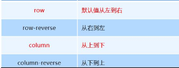
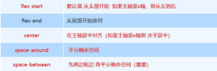
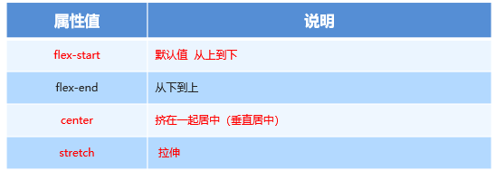
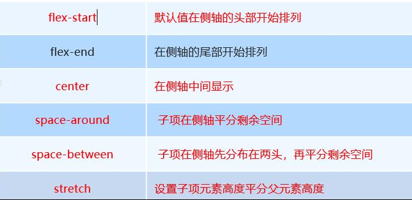
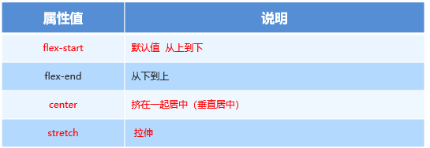

# 1	流式布局

## 案例：京东小页面

### 1	流式布局使用

传统布局：百分比控制宽度布局，浮动，清除浮动；

### 2	准备工作

#### A 搭建文件结构：


#### B 设置视口标签、初始化样式：

```html
<meta name="viewport" content="width=device-width, user-scalable=no,initial-scale=1.0, maximum-scale=1.0, minimum-scale=1.0">

<link rel="stylesheet" href="css/normalize.css">
<link rel="stylesheet" href="css/index.css">
```

#### C normalize.css：相当于以前基础班大家写的base.css

- 团队，初始化CSS文件
- http://necolas.github.io/normalize.css/
- 保护了有价值的默认值；
- 修复了浏览器的bug；

#### D body样式的初始化设置：

- min-width: 320px;不允许比这个尺寸更小，不然布局体验不好；
- max-width: 640px;最大宽度，不超过768px，一般按照公司要求来；

```css
body {
  width: 100%;
  min-width: 320px;
  max-width: 640px;
  margin: 0 auto;
  font-size: 14px;
  color: #666;
}
```

#### E    dpg 、 webp

- dpg：京东自主研发推出DPG图片压缩技术，经测试该技术，可直接节省用户近50%的浏览流量，极大的提升了用户的网页打开速度。全部浏览器的兼容支持，压缩后的图片和webp的清晰度对比没有差距。
- webp：谷歌开发的一种旨在加快图片加载速度的图片格式。图片压缩体积大约只有JPEG的2/3，并能节省大量的服务器宽带资源和数据空间；

#### F 其他

1. 先看这个盒子要不要设置高度，没有高度的时候，一般是靠内部子元素撑起来的。
2. 伪元素：左侧或右侧的线、简单的图标采用伪元素进行设置；
3. 结构伪类选择：n 作为参数，一定要放在前面
4. 清除浮动补充：

```css
/* 必须指定宽度*/
div {
   width: 100%;
   overflow: hidden;
}
```

- 前端性能提升：
  - 减少HTML结构；


### 3	顶部栏

```html
  <!-- 顶部栏 -->
  <header>
    <div>
      
    </div>
    <div>
      
    </div>
    <div>打开京东App，购物更轻松立即</div>
    <div>立即打开</div>
  </header>
```

样式：

```css
body {
  width: 100%;
  /* 最小宽度 320px 要求浏览的屏幕不能比320px*/
  min-width: 320px;
  /* 最大宽度 根据公司业务，不会超过768px*/
  max-width: 640px;
  margin: 0 auto;
  font-size: 14px;
  background-color: #ccc;
}

a {
  text-decoration: none;
}

a:hover {
  text-decoration: none;
}


/* --------------------------------------------顶部栏 */

header {
  height: 45px;
}

header div {
  float: left;
  height: 45px;
  background-color: #222;
  line-height: 45px;
  text-align: center;
  color: #fff;
  font-size: 14px;
}

header div:nth-child(1) {
  width: 8%;
}

header div:nth-child(1) img {
  width: 10px;
}

header div:nth-child(2) {
  width: 10%;
}

header div:nth-child(2) img {
  width: 30px;
  vertical-align: middle;
}

header div:nth-child(3) {
  width: 57%;
}

header div:nth-child(4) {
  width: 25%;
  background-color: red;
}


```


### 4	搜索区

```
  <!-- 搜索区 -->
  <div class="search">
    <div class="left"></div>
    <div class="mid">
      <div class="JD"></div>
      <div class="FD"></div>
    </div>
    <div class="right">登录</div>
  </div>
```

样式：

```css
.search {
  height: 44px;
  position: relative;
  box-sizing: border-box;
  padding: 0 40px;
  overflow: hidden;
  /* 1.固定定位  使用absolute fixed 默认宽度100% 失效*/
  /* 按照原来在文档中位置，进行脱标 */
  position: fixed;
  /* 2.手动加100% */
  width: 100%;
  /* 3.不是相对于body ，又不是HTML，只能相对于浏览器的可视窗口 */
  /* 又想和body一样宽， */
  /* 最小宽度 320px 要求浏览的屏幕不能比320px*/
  min-width: 320px;
  /* 最大宽度 根据公司业务，不会超过768px*/
  max-width: 640px;
}

.search .left {
  width: 40px;
  height: 44px;
  /* background-color: #222; */
  position: absolute;
  top: 0;
  left: 0;
}

.search .left::before {
  content: "";
  display: block;
  width: 20px;
  height: 18px;
  background: url('../imgs/s-btn.png') no-repeat;
  background-size: 100%;
  margin: 14px 0 0 15px;
}


/* --------中间区域 */

.search .mid {
  /* width: 100%; */
  height: 30px;
  /* 外边距塌陷 */
  margin: 7px 10px;
  border-radius: 15px;
  background-color: #fff;
  position: relative;
}

.search .mid .JD {
  width: 20px;
  height: 15px;
  background: url('../imgs/jd.png') no-repeat;
  background-size: 100%;
  position: absolute;
  top: 7px;
  left: 15px;
}


/* 小竖线 */

.search .mid .JD::before {
  content: "";
  width: 1px;
  height: 15px;
  border-right: 1px solid #ccc;
  position: absolute;
  top: 0;
  right: -8px;
}


/* 放大镜 */

.search .mid .FD {
  width: 15px;
  height: 15px;
  background: url('../imgs/jd-sprites.png') no-repeat -83px 0;
  background-size: 199px;
  position: absolute;
  top: 8px;
  left: 50px;
}


/* --------右侧区域 */

.search .right {
  width: 40px;
  height: 44px;
  line-height: 44px;
  color: #fff;
  /* background-color: pink; */
  position: absolute;
  top: 0;
  right: 0;
}

```


### 5	轮播图及广告区

```
  <!-- 轮播图 -->
  <div class="banner">
    <a href="#">
      
    </a>
  </div>
   <!-- 广告区 -->
  <div class="ads">
    <a href="#">
      
    </a>
    <a href="#">
      
    </a>
    <a href="#">
      
    </a>
  </div>
```

样式：

```css
/* ------------------------------------------- 轮播图*/

.banner {}

.banner a {
  display: block;
}

.banner a img {
  width: 100%;
}


/* ---------------------------------------------广告区 */

.ads {
  width: 100%;
  overflow: hidden;
}

.ads a {
  /* display: block; */
  float: left;
  width: 33.33%;
}

.ads a img {
  width: 100%;
}

```


### 6	导航区

```html
 <!-- 导航 -->
  <nav>
    <a href="#">
      
      <p>京东超市</p>
    </a>
    <a href="#">
      
      <p>京东超市</p>
    </a>
    <a href="#">
      
      <p>京东超市</p>
    </a>
    <a href="#">
      
      <p>京东超市</p>
    </a>
    <a href="#">
      
      <p>京东超市</p>
    </a>
    <a href="#">
      
      <p>京东超市</p>
    </a>
    <a href="#">
      
      <p>京东超市</p>
    </a>
    <a href="#">
      
      <p>京东超市</p>
    </a>
    <a href="#">
      
      <p>京东超市</p>
    </a>
    <a href="#">
      
      <p>京东超市</p>
    </a>
  </nav>
```

样式：

```css
/* ----------------------------------------------------导航区 */

nav {
  width: 100%;
  margin: 30px 0;
  overflow: hidden;
}

nav a {
  float: left;
  width: 20%;
  text-align: center;
  color: #666;
}

nav a img {
  width: 40px;
}

```


### 7	福利区

```
<!-- 抽奖区 -->
  <div class="chouj">
    <a href="#">
      
    </a>
    <a href="#">
      
    </a>
    <a href="#">
      
    </a>
  </div>
```

样式：

```css
/* --------------------------------------------抽奖区 */

.chouj {}

.chouj a {
  float: left;
  width: 25%;
}

.chouj a img {
  width: 100%;
}

.chouj a:nth-child(1) {
  width: 50%;
}


/* 选后两个盒子 */


/* n 从0开始 自学2n 2n+1*/


/* n+2 n必须在前面 */

.chouj a:nth-child(n+2) {
  box-sizing: border-box;
  border-left: 1px solid #ccc;
}
```

# 2	flex布局

- 特点：布局快；
- 缺点：在PC端兼容性差；移动端首选flex布局；
- 名称：flex布局又叫**伸缩布局 、弹性布局** 、**伸缩盒布局** 、**弹性盒布局 ；**
- 语法：

```css
display:flex;
```

​	特点：flex 是 flexible Box 的缩写，意为"弹性布局"，用来为盒状模型提供最大的灵活性操作，

- 任何一个标签都可以指定使用 flex 布局。
- 当为父盒子设为 flex 布局以后，子元素的 **float、clear 和 vertical-align** 属性将失效。
- flex通过行和列的思路来控制布局，使用思想上和传统盒子完全不同，不要再想是块级元素、行内元素等；

## 重点属性

- **确认主轴方向：flex-direction**
- **侧轴上子元素的排布：align-items（单行）**
- **flex**

## 1	flex-direction

- 选择主轴方向，另外一个轴变为侧轴；

- 特点：主轴上的元素按照主轴的方向进行排布；

- 语法：

- 

  

- 特点:
  - 默认：主轴： x 轴方向，水平向右；侧轴：是y 轴方向，水平向下；
  - 该属性是改变主轴的选择，即选择一个轴为主轴，另外一个自动成为侧轴；(这里说的并不是改变轴的指向)；
  - **当前元素会按照主轴的正方向 进行 排列**


## 2	justify-content属性

- 单词justify：整理版面
- 控制**主轴上的元素**的对齐方式，类似word里的左对齐，右对齐，居中对齐，分散对齐；
- 语法值：



space: 剩余空间，项目没有占用掉的空间；

## 3	flex-wrap和flex-flow

- flex-wrap：默认不换行；子元素的总宽加起来超过父亲的宽度，不换行，子元素宽度被自适应压缩；

  ```css
  
        /* 换行 */
        /* flex-wrap: wrap/nowrap; */
  ```

  

- flex-flow ：主轴方向 和 换行的 复合属性；了解

  ```css
        /* 复合属性：设置主轴方向，设置是否换行 */
        flex-flow: row wrap;
  ```

  


## 4	align-items

语法：侧轴上单行的对齐方式，一定把这些看成整体



stretch 拉伸：

- 子项目高度没有时，在侧轴方向就会拉伸；
- 子项目有高度时，按照子项的高度显示 ；


## 5	align-content

- 控制子元素在侧轴上，**多行（换行）**的对齐方式；

- 属性值设置：

- 

  


## 6	flex属性！！！

- flex：划分剩余空间

  - 份数：子元素加起来一共多少份，去分你的剩余空间，看各自子元素占多少份 ；

  - %：必须保证所有的子元素加起来是100%；（常规用法）；

    ```css
    .item {
        /* 默认值 0 flex来表示占多少份数，不设置宽高，在宽高方向全部进行剩余空间的划分*/
        flex: <number>; 
        
        /* 分配剩余空间的百分比,使用%，必须加起来是百分之百 */
        flex: 20%; 
    }
    ```

    

- 场景：左右固定宽度，中间随意拉伸；


## 7	align-self

- 控制自身元素在侧轴上对齐方式；

- 默认值auto：

  - 当父亲设置了align-items，auto继续父亲align-items属性值；和父亲一样；

  - 当父亲没有设置了align-items，auto变为strecth，（高度注释掉，才可以看见）；

    

- 使用：配合flex属性，主轴方向自动划分份数，侧轴方向自动拉伸；

  


## 8	order（了解）

- 属性定义子项目的排列顺序，数值越小，排列越靠前，默认为0。
- 可以设置为负数；注意和 z-index 不一样。这里是表示位数；

```css

 .son_2 {
   width: 100px;
   height: 100px;
   background-color: blue;
   order: -1;
 }
```


