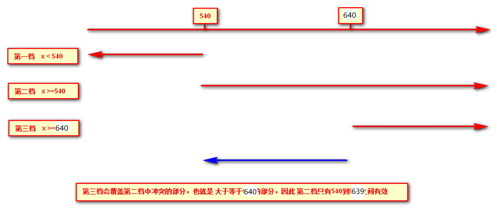

# 01-flex-项目属性-案例


# 02-flex-携程-准备工作


# 03-flex-携程-顶部搜索区

* 重点：
  * 左侧随意拉伸（flex:1）,右侧固定宽度；flex布局
  * 固定定位：使用定位类 不设置left top 按照原来的位置进行脱标；


# 04-flex-携程-轮播图


# 05-flex-携程-flex导航区


# 06-flex-携程-大导航


# 07-rem布局-rem单位

* 1rem = HTML 字体大小
* 特点：只要元素盒子用到rem单位，1rem背后代表（ HTML 字体大小）变化，整个用到rem单位都会跟着变化；


# 08-rem布局-媒体查询-语法

* 语法：响应屏幕的宽度

```
    /* @media:关键字，媒体查询开头 */
    /* screen :查屏幕 */
    /* CSS-Code; 里面写 正常CSS 代码 */
    /* 查屏幕 且 当前宽度是500px时候，执行下面的CSS代码*/
    /* @media screen and (width:500px) {
      body {
        background-color: red;
      }
    } */
    /* 当前宽度最小值是500px  w>=500px */
    /* @media screen and (min-width:500px) {
      body {
        background-color: red;
      }
    } */
    /* 当前宽度最大值是500px  w<=500px  */
    
    @media screen and (max-width:500px) {
      body {
        background-color: red;
      }
    }
```

* max-width/min-width包含等号的；


# 09-rem布局-媒体查询-档位划分

```css
   /* - 档位1：w<540px w <=539px; */
    /* @media screen and (max-width:539px) {
      body {
        background-color: red;
      }
    } */
    
    @media screen and (min-width:0) {
      body {
        background-color: red;
      }
    }
    /* - 档位2 : 540px<=w and w<640px; */
    /* @media screen and (min-width:540px) and (max-width:639px) {
      body {
        background-color: blue;
      }
    } */
    
    @media screen and (min-width:540px) {
      body {
        background-color: blue;
      }
    }
    /* - 档位3 : 640px<=w */
    
    @media screen and (min-width:640px) {
      body {
        background-color: green;
      }
    }
```




# 10-rem布局-rem&媒体查询

* rem：全局的唯一控制，元素得使用rem单位;  1rem = HTML 字体大小
* 媒体查询：
  * 响应屏幕变化；
  * CSS-code：不同档位的HTML 字体大小

* rem+媒体查询：看当前的屏幕在哪个档位下，1rem背后的值就确定，用到rem单位属性就算出来；等比变化；


# 11-rem布局-less-安装

* less：CSS扩展语言。
* 预处理：VSC 插件；
* webpack gulp :包 自动帮你帮less问转化CSS文件；


# 12-rem布局-less-语法

* less：CSS的扩展语言，在less文件里写正常的CSS-code 可行；


