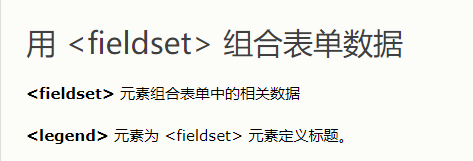

表单的作用：跟用户进行交互，收集用户资料

## 一	表单构成

在HTML中，一个完整的表单通常由表单控件（也称为表单元素）、提示信息和表单域3个部分构成。

```
 表单控件：

​       包含了具体的表单功能项，如单行文本输入框、密码输入框、复选框、提交按钮、重置按钮等。

  提示信息：

​        一个表单中通常还需要包含一些说明性的文字，提示用户进行填写和操作。

  表单域：  

​      他相当于一个容器，用来容纳所有的表单控件和提示信息，可以通过他定义处理表单数据所用程序的url地址，以及数据提交到服务器的方法。如果不定义表单域，表单中的数据就无法传送到后台服务器。

```

## 二	input控件

> ，&lt;input /&gt;标签为单标签，type属性为其最基本的属性，其取值有多种，用于指定不同的控件类型。除了type属性之外，&lt;input /&gt;标签还可以定义很多其他的属性，其常用属性如下表所示。

| 属性      | 属性值   | 描述                         |
| --------- | -------- | ---------------------------- |
| type      | text     | 单行文本输入框               |
|           | password | 密码输入框                   |
|           | radio    | 单选按钮                     |
|           | checkbox | 复选框                       |
|           | button   | 普通按钮                     |
|           | submit   | 提交按钮                     |
|           | reset    | 重置按钮                     |
|           | image    | 图像形式的提交按钮           |
|           | file     | 文件域                       |
|           |          |                              |
| name      | 自定义   | 控件的名称                   |
| value     | 自定义   | input控件的默认文本值        |
| size      | 正整数   | input控件在页面中的显示宽度  |
| checked   | checked  | 定义被选择控件默认被选中的项 |
| maxlength | 正整数   | 控件允许输入的最多字符数     |

## 三	label标签：

label 标签为 input 元素定义标注（标签）。

作用：  用于绑定一个表单元素, 当点击label标签的时候, 被绑定的表单元素就会获得输入焦点

如何绑定元素呢？

for 属性规定 label 与哪个表单元素绑定。

```html
<label for="male">Male</label>
<input type="radio" name="gender" id="male" value="male">
```

## 四	文本域

如果需要输入大量的信息，就需要用到&lt;textarea&gt;&lt;/textarea&gt;标签。通过textarea控件可以轻松地创建多行文本输入框，其基本语法格式如下：

```html
<textarea cols="每行中的字符数" rows="显示的行数">
  文本内容
</textarea>
```


**一定要记住	在textarea标签内写默认文本时一定不要有空格 不然显示出的文本域中的提示文本前边会有空格**

```
<textarea cols="每行中的字符数" rows="显示的行数">
  文本内容
</textarea>			<!--这样就是错的，这样显示出的默认文本前边会有大量空格-->
<textarea cols="每行中的字符数" rows="显示的行数">文本内容</textarea>	<!--这样才对-->
```

## 五	下拉菜单

使用select控件定义下拉菜单的基本语法格式如下

```html
<select>
  <option>选项1</option>
  <option>选项2</option>
  <option>选项3</option>
  ...
</select>
```

注意：

1. &lt;select&gt;</select&gt;中至少应包含一对&lt;option></option&gt;。
2. 在option 中定义selected =" selected "时，当前项即为默认选中项。


## 六	表单域

在HTML中，form标签被用于定义表单域，即创建一个表单，以实现用户信息的收集和传递，form中的所有内容都会被提交给服务器。创建表单的基本语法格式如下：

```html
<form action="url地址" method="提交方式" name="表单名称">
  各种表单控件
</form>
```

常用属性：

1. Action
   在表单收集到信息后，需要将信息传递给服务器进行处理，action属性用于指定接收并处理表单数据的服务器程序的url地址。
2. method
   用于设置表单数据的提交方式，其取值为get或post。
3. name
   用于指定表单的名称，以区分同一个页面中的多个表单。

**注意：  每个表单都应该有自己表单域。没有表单域的控件不生效 像提交按钮，没处提交去**

## 七  补充两个表单标签

​	


​	

```html

<fieldset>
<legend>Personal information:</legend>
First name:<br>
<input type="text" name="firstname" value="Mickey">
<br>
Last name:<br>
<input type="text" name="lastname" value="Mouse">
<br><br>
<input type="submit" value="Submit">
</fieldset>
</form>

```

legend要紧跟在fieldest之后，排在所有元素之前。


## 八	属性详解

### 1	表单工作原理


### 2	单行文本域属性

| 属性        | 描述                                                         |
| ----------- | ------------------------------------------------------------ |
| Name        | 文字域的名称                                                 |
| Maxlength   | 指用户输入的最大字符数                                       |
| Size        | 指定文本框的宽度，以字符个数为单位。文本框的缺省宽度是20个字符 |
| Value       | 指定文本框的默认值                                           |
| Placeholder | 用户输入字段的提示                                           |

### 3	下拉菜单和列表标签


select标签属性

| 属性     | 描述                     |
| -------- | ------------------------ |
| name     | 设置下拉菜单和列表的名称 |
| multiple | 设置可选择多个选项       |
| size     | 设置列表中可见选项的数目 |

option列表属性

| 属性     | 值                     |
| -------- | ---------------------- |
| selected | 设置选项初识选中状态   |
| value    | 定义送往服务器的选项值 |

分组：


### 4	多行文本域


属性

| 属性        | 描述                   |
| ----------- | ---------------------- |
| name        | 设置文本区的名称       |
| placeholder | 提示                   |
| rows        | 设置文本区内的可见行数 |
| cols        | 设置文本区的可见宽度   |

### 5 form


form标签属性：

| 属性    |                              值                              | 描述                               |
| ------- | :----------------------------------------------------------: | ---------------------------------- |
| action  |                             url                              | 提交表单时向何处发送表单数据       |
| method  |                          get、post                           | 设置表单以何种方式发送到指定页面   |
| name    |                          form_name                           | 表单名                             |
| target  |                 _blank  _self  _parent _top                  | 在何处打开action URL               |
| enctype | application/x-www-form-urlencodedmultipart/form-datatext/plain | 在发送表单数据之前如何对其进行编码 |

**post和get的区别：**

**Get**

- [x] 使用URL传递参数
- [x] 对所发送信息的数量也有限制
- [x] 一般用于信息获取	

​	

**Post**

- [x] 表单数据作为HTTP请求体的一部分
- [x] 对所发送信息得数量无限制
- [x] 一般用于修改服务器上的资源 


​	