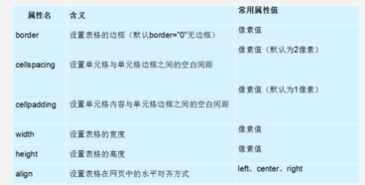

HTML之表格

表格的应用场景：


一	创建表格

语法格式：

```
<table>
  <tr>
    <td>单元格内的文字</td>
    ...
  </tr>
  ...
</table>
```

```
1.table用于定义一个表格。

2.tr 用于定义表格中的一行，必须嵌套在 table标签中，在 table中包含几对 tr，就有几行表格。

3.td /td：用于定义表格中的单元格，必须嵌套在<tr></tr>标签中，一对 <tr> </tr>中包含几对<td></td>，就表示该行中有多少列（或多少个单元格）。

```

> 1. <tr></tr>中只能嵌套<td></td><th></th>
> 2. <td></td>标签，他就像一个容器，可以容纳所有的元素

二	表格属性




​	**tr标签属性**


​	

|  属性   |               值               |       描述       |
| :-----: | :----------------------------: | :--------------: |
|  align  | left center right justify char | 行内容的水平对齐 |
| valign  |   top middle bottom baseline   | 行内容的垂直对齐 |
| bgcolor |    rgb()  #XXXXXX colorname    |   行的背景颜色   |

​	td和th标签属性	

|  属性   |               值               |         描述         |
| :-----: | :----------------------------: | :------------------: |
|  align  | left center right justify char | 单元格内容的水平对齐 |
| valign  |  top midddle bottom baseline   | 单元格内容的垂直对齐 |
| bgcolor |    rgb() #XXXXXX colorname     |   单元格的背景颜色   |
|  width  |        %  或者实际数值         |     单元格的宽度     |
| height  |        %  或者实际数值         |     单元格的高度     |

thead tbody tfoot属性


三	表格标题

表格标题	 caption	


```html
<table>
   <caption>我是表格标题</caption>
</table>
caption 标签必须紧随 table 标签之后。只能对每个表格定义一个标题。通常这个标题会被居中于表格之上。
```

四 表头标签

表头一般位于表格的第一行或第一列，其文本**加粗居中**，如下图所示，即为设置了表头的表格。设置表头非常简单，只需用表头标签&lt;th&gt;</th&gt;替代相应的单元格标签&lt;td&gt;</td&gt;即可。


五	表格结构

```
在使用表格进行布局时，可以将表格划分为头部、主体和页脚（页脚因为有兼容性问题，我们不在赘述），具体 如下所示：

<thead></thead>：用于定义表格的头部。

必须位于<table></table> 标签中，一般包含网页的logo和导航等头部信息。


<tbody></tbody>：用于定义表格的主体。

位于<table></table>标签中，一般包含网页中除头部和底部之外的其他内容。
```


六	合并单元格	有点难

​	

```
 跨列合并：colspan   跨行合并：rowspan   
 水平合并			 垂直合并

合并单元格的思想：

将多个内容合并的时候，就会有多余的东西，把它删除。    例如 把 3个 td 合并成一个， 那就多余了2个，需要删除。
```


七	表格嵌套


