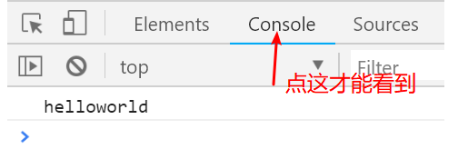
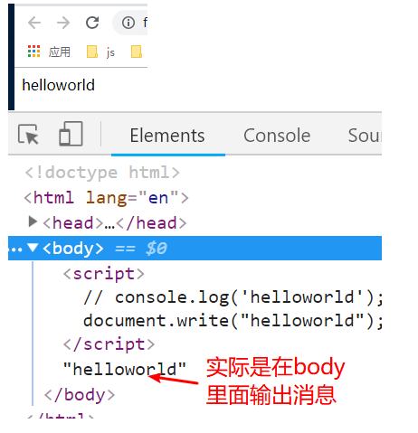

#	初识JavaScript	

> Javascript是一门运行在**浏览器**上的**脚本语言**

## 1	JavaScript的简介

- 为什么要学习JavaScript
  - 如果希望我们制作的网页可以与用户进行交互，就需要JavaScript进行操作
- JavaScript最初的作用（了解）
  - 最初就是为了进行表单内容验证，现在的功能比最初丰富了很多很多
    - 现在可以做网页，可以做应用（APP，桌面应用），小程序。。。。。
- JavaScript语言的组成部分（3部分）
  - ECMAScript简称为ES，指的是JavaScript的基础语法，语言规范
    - 是本小阶段的主要内容，在这些阶段中都有讲解：JavaScript基础、JavaScript高级、Nodejs
  - BOM 浏览器对象模型， 本质上是一组用来操作浏览器功能的工具。
  - DOM 文档对象模型，本质上是一组用来操作文档 (HTML页面) 的工具


## 2	JavaScript的书写方式

>   **JavaScript和css一样，也有三种书写方式**

- 外链式（推荐）

  - 示例：  \<script src="地址">\</script>
  - 注意点：不要在外链式的script中书写代码，没用

- 内嵌式

  - 示例： \<script> 这里书写代码即可 \</script>	一般写在页面底部

- 行内式（不推荐）

  ```html
  <input type="button" value="点我" onclick="alert('helloworld')">
  ```

  > **js注释**
  >
  > 单行注释：
  >
  > ```
  > // 在这里写你要注释的内容
  > ```
  >
  > 多行注释：
  >
  > ```
  > /*
  > 	在这写你要注释的内容
  > */
  > ```
  >
  > 


## 3	变量操作

- 为什么要有变量
  - 为了让数据使用方便，避免出错。
- 什么是变量
  - 变量就是用来存储数据的容器
- 变量怎么操作
  - 变量的声明操作（定义操作）
    - var 变量名;
  - 变量的赋值操作（给变量设置数据）
    - 先声明变量，然后再赋值
    - var 变量名;  变量名 = 数据;
  - 声明变量的同时进行赋值
    - var 变量名 = 数据;
  - 同时声明或赋值多个变量
    - var 变量名1 = 数据1， 变量名2， 变量名3 = 数据3；


## 4	变量的命名规则和规范

- 规则：(不能违反，如果违反会报错)
  - 变量名可以使用字母，_下划线， $美元符号   开头
  - 组成中除了上面的形式外，还可使用数字
  - 不能使用js中的关键字和保留字
  - 名称区分大小写
- 规范：(建议性的写法，不遵守也没问题，但是推荐遵守)
  - 命名有意义
  - 命名由多部分组成时，推荐使用驼峰命名法
    - var myNum = 10001；

错误代码提示：

**1 变量使用数字开头**

```js
// 变量不能使用数字开头
var 15a = 10;
// 会在控制台中报错：Uncaught SyntaxError: Unexpected number
// Uncaught - 未捕获的
// SyntaxError - 语法错误
// Unexpected - 意料之外的
// number - 数字
// 翻译过来就是： 这行有一个语法错误，你的数字不符合语法要求
```

**2 使用关键字作变量名**

```js
// 变量名字不能使用关键字
var var = 20;
// 会在控制台中报错： Uncaught SyntaxError: Unexpected token var
// token - 标记，记号，在编程中我们翻译成 '标识符'
// 意思是这行有一个语法错误，出现了一个意料之外的标识符 var
```

**3 变量名大小写**

```
// 变量名字是区分大小写的
var a = 10;
console.log(a);// 正常输出
console.log(A);// 在控制台中报错：Uncaught ReferenceError: A is not defined
// ReferenceError - 引用错误
// not defined - 未定义
// 意思是 A 这个变量我们没有定义就使用了，可见a和A是不一样的，不是同一个变量
```


## 5	js常用的输出方式

- **alert() 弹出提示框**

  ```js
  alert("提示消息"); // 在小括号里面写一个你要输出的消息，如果不是数字，请使用双引号包起来
  alert('提示消息'); // 或者使用单引号包起来也行
  ```

  

- **console.log(); 在控制台中输出内容  (常用)**

  ```js
  console.log("helloworld"); // 如果消息不是数字，还是使用引号包起来
  ```

  

- **confirm() 确认提示框，比alert多了个取消按钮**

  ```js
  confirm('你确定？');
  ```

  

- **prompt() 输入提示框，比confirm多了个输入框**

  ```js
  prompt("请输入你的银行卡密码"); // 同样使用引号包起来
  ```

  

  

- **document.write() 在页面中展示内容**

  - 如果内容中存在标签，标签会生成为html标签结构
  - 设置为在body中

```javascript
document.write('helloworld');
```

效果：



## 6	数据类型

- js中的数据类型分为两类： 基本类型(简单类型、原始类型)，复杂类型。
- 5个基本数据类型的组成：
  - 数值类型 number:
    - 组成
      - 基本数值：生活中的整数和小数， 200， 3.1， -8， -57.43   
      - 特殊值： NaN - not a number - 非数值
    - 极限值的概念：(了解即可)
      - 生活中存在无限大无限小的概念，但是只存在于理论中
      - 计算机中的编程语言不存在无限的概念，数值是具有可表示的上下限的
        - Number.MAX_VALUE 表示js中可展示的最大整数位
          - 超出后取 Infinity
        - Number.MIN_VALUE 表示js中可展示的最小小数位
  - 字符串类型 string:
    - 标识方式： 通过成对的英文半角的单引号或双引号包裹。
      - 推荐：js中推荐使用单引号进行字符串标识
    - 转义符的使用：
      - 功能1：将特殊字符转换为普通字符
      - 功能2： 将普通字符转换为特殊字符
  - 布尔类型 boolean:
    - 用来表示生活中的真和假
      - true 真
      - false 假
  - undefined 未定义：(默认为空)
    - 通常是出现在某些操作的默认值中
      - 变量声明但是没有赋值：  var num;     console.log(num); // undefined
      - 后面的一些操作中也会出现默认为undefined的情况，到时会再说，最后会进行总结。
  - null 空: (主动设置为空)
    - 通常为主动的设置变量为空。
      - var num = 100;  num = null;


## 7	类型检测方式

- 使用方式：

  - typeof 数据;
  - typeof(数据);

- 结果为数据对应的类型名称，名称为字符串形式。

  - 问题：对null的类型检测结果不准确，对象部分会讲解其他检测方式

- 浏览器中的偷懒的查看类型方式（看数据的颜色）

  ​	**在浏览器控制台中：**

  - 数值和布尔为蓝色，字符串为黑色，null和undefined为灰色


## 8	数据类型转换操作

- 将其他类型转换为字符串类型
  - 强制类型转换
    - 数据.toString()
      - null和undefined无法使用toString()

      - （了解）数值类型直接操作toString功能时，多加一个点.    例如 100..toString()

        ```js
        var res1 = (123).toString();
        console.log(res1); // 输出字符串123
        console.log(typeof res1); // 输出string
        
        var res2 = true.toString();
        console.log(res2); // 输出字符串true
        console.log(typeof res2); // 输出string
        
        var res3 = undefined.toString();
        console.log(res3); // 报错：Cannot read property 'toString' of undefined
        
        var res4 = null.toString();
        console.log(res4); //报错： Cannot read property 'toString' of null
        ```

        
    - String(数据)

      - 任意类型都可以使用

        ```js
        var res1 = String(123);
        console.log(res1);  // 输出字符串的 123
        console.log(typeof res1); // 输出 string
        
        var res2 = String(true);
        console.log(res2); // 输出字符串的 true
        console.log(typeof res2); // 输出 string
        
        var res3 = String(undefined);
        console.log(res3); // 输出 字符串 undefined
        console.log(typeof res3);// 输出 string
        
        var res4 = String(null);
        console.log(res4); // 输出 字符串null
        console.log(typeof res4); // 输出 string
        ```

        
  - 隐式类型转换（常用）
    - 任意字符串进行+操作，都表示内容连接，结果为连接后的字符串
    - 进行类型转换时，使用空字符串进行连接操作 ''  前面写的是两个单引号
- 数值类型转换
  - 强制类型转换
    - Number(数据) 

      ```js
      var res1 = Number('123');
      console.log(res1); // 输出数字123
      console.log(typeof res1); // 输出 number
      
      var res2 = Number(true);
      console.log(res2);// 输出 1
      console.log(typeof res2); // 输出number
      
      var res3 = Number(null);
      console.log(res3); // 输出0
      console.log(typeof res3); // 输出number
      
      var res4 = Number(undefined);
      console.log(res4); // 输出 NaN  , NaN 就是 not a  number 的缩写，表示某个结果不是一个数字
      console.log(typeof res4); // 输出 number
      ```

      

    - parseInt(数据) 

      - 规则：从左往右找到数值部分(整数)

        ```js
        var res1 = parseInt('123');
        console.log(res1); // 输出 123 
        console.log(typeof res1); // 输出number
        
        var res2 = parseInt('12a');
        console.log(res2);// 输出 12
        console.log(typeof res2);// 输出number
        
        var res3 =parseInt('a123');
        console.log(res3); // 输出 NaN
        console.log(typeof res3); // 输出number
        ```

        

    - parseFloat(数据)

      - 规则：从左往右找到数值部分(整数和小数)

        ```js
        var res1 = parseInt('123.123');
        console.log(res1); // 输出 123.123
        console.log(typeof res1); // 输出number
        
        var res2 = parseInt('12.12a');
        console.log(res2);// 输出 12.12
        console.log(typeof res2);// 输出number
        
        var res3 =parseInt('a12.3');
        console.log(res3); // 输出 NaN
        console.log(typeof res3); // 输出number
        ```

        
  - 隐式类型转换 （只需要记忆正号，其余作为了解）
    - +- 正负号     +3    -2 
    - +-*/% 四则运算
- 布尔类型转换
  - 转换方式：Boolean()
  - 主要要掌握的是转换结果为false的值（6个）：
    - '空' 	0 	NaN 	null 	undefined 	false  

    - 以后我们学习的其他类型转换结果也都是true

      ```js
      var res1 = Boolean(123);
      console.log(res1);// 输出true
      console.log(typeof res1); // 输出 boolean
      
      var res2 = Boolean('abc');
      console.log(res2);// 输出true
      console.log(typeof res2); // 输出 boolean
      
      var res3 = Boolean(undefined);
      console.log(res3);// 输出false
      console.log(typeof res3); // 输出 boolean
      
      var res4 = Boolean(null);
      console.log(res4);// 输出false
      console.log(typeof res4); // 输出 boolean
      ```

      

小练习：

```js
    <!-- <script>
        var name = prompt("姓名",name);
        var age = prompt("年龄",age);
        var gentle = prompt("性别",age);

        alert('姓名：'+name+'\n'+'年龄：'+age+'\n'+'性别：'+gentle);
        // prompt("姓名：");
    </script> -->
    <!-- <script>
            var num1 = prompt("数值1",num1);
            var num2 = prompt("数值2",num2);
            // var gentle = prompt("性别",age);
            var sum = Number(num1)+Number(num2);
            alert('num1+num2='+ sum);
            // prompt("姓名：");
        </script> -->
```

